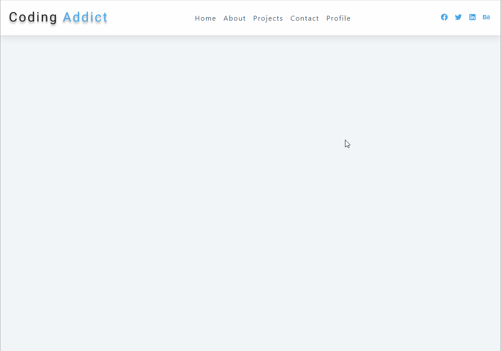

<h1 align="center">
  Dynamic Navbar Toggle
</h1>

## 💻 Project

- Learning ReactJS;
- A toggle navbar built using 'useRef' hook to manipulate the DOM, producing dynamic adjustments to set the more suitable 'height' style property for the links container.

&nbsp;&nbsp;

---

## 🔥 Check it out!

 

- [https://dynamic-navbar.netlify.app/](https://dynamic-navbar.netlify.app/)

  

&nbsp;&nbsp;

